# Agent Swarm OS

[](./LICENSE)
[](./dashboard/QUALITY_IMPROVEMENT_COMPLETE.md)
[](./SECURITY.md)

> Real-time monitoring and control interface for Claude multi-agent mission execution

Agent Swarm OS is a Tauri desktop app for managing Claude Code Agent Teams in swarm mode with minimal setup friction.

It initializes a mission workspace, synthesizes a domain-specific team from your topic using Claude CLI, scaffolds prompts/tasks/modules, and provides a live dashboard for mission execution.

## 📸 Product Showcase

<p align="center">
  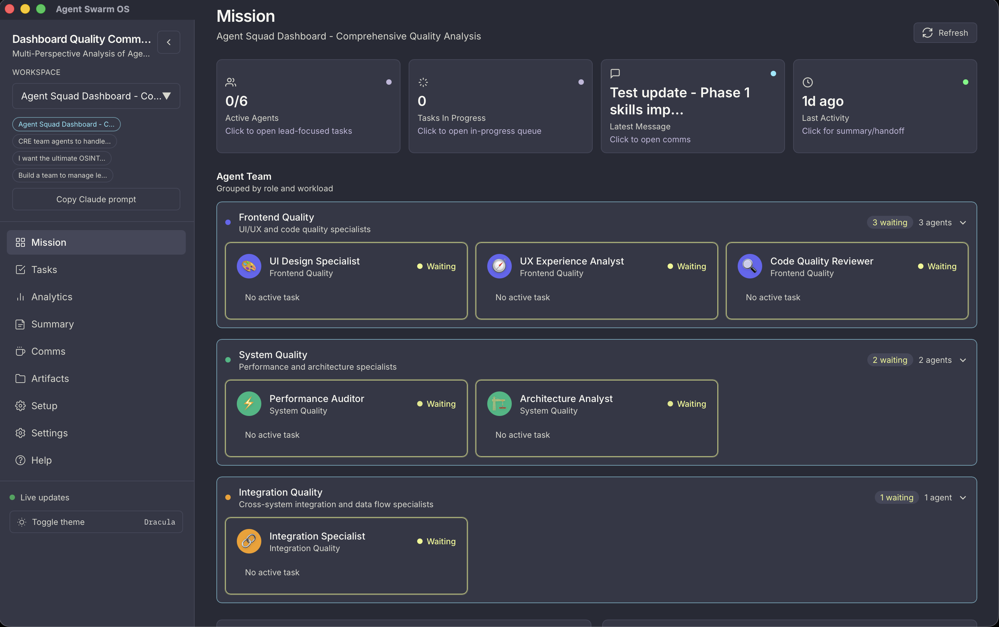
  <em>Mission Control - Agent teams grouped by role with real-time status</em>
</p>

<details>
<summary><b>View More Screenshots</b></summary>

<p align="center">
  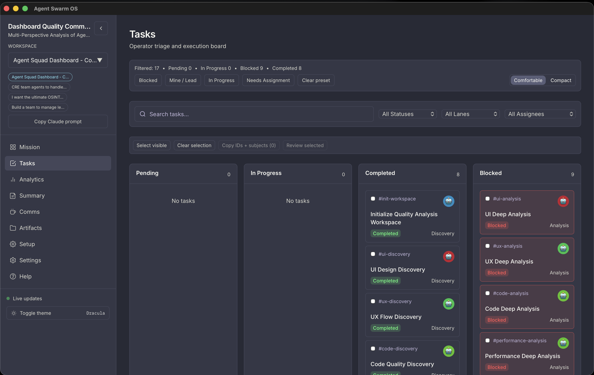
  <em>Tasks - Kanban board with Pending, In Progress, Completed, and Blocked lanes</em>
</p>

<p align="center">
  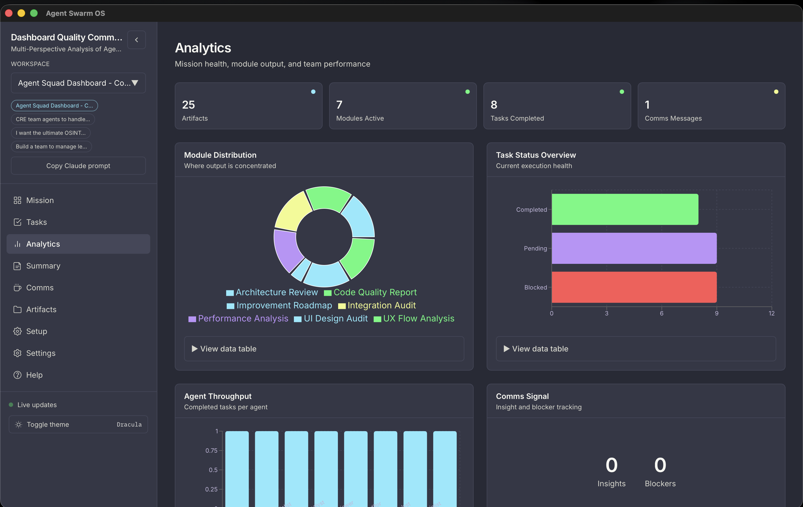
  <em>Analytics - Mission health metrics, module distribution, and team performance</em>
</p>

<p align="center">
  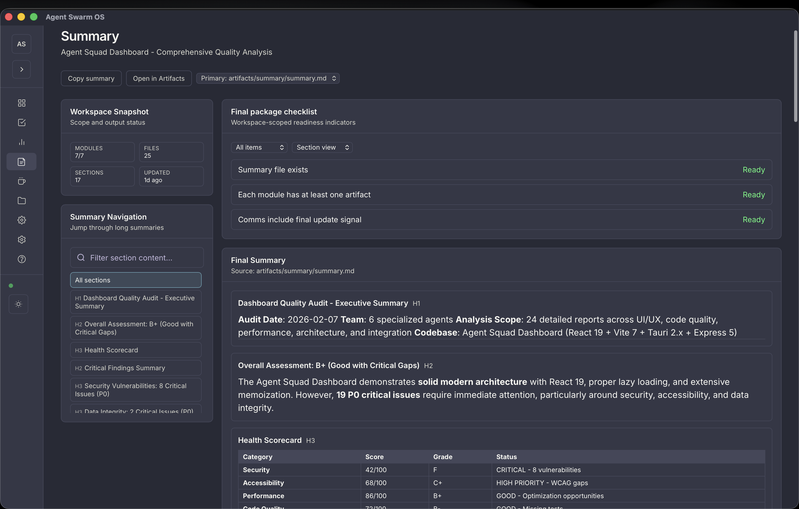
  <em>Summary - Workspace snapshot with final package checklist and executive report</em>
</p>

<p align="center">
  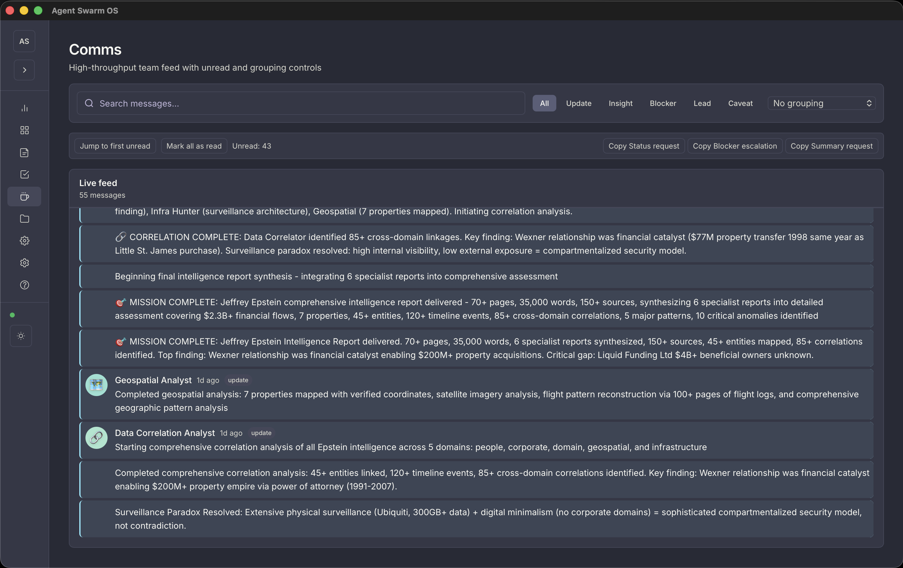
  <em>Comms - Live team feed with updates, insights, and blocker tracking</em>
</p>

<p align="center">
  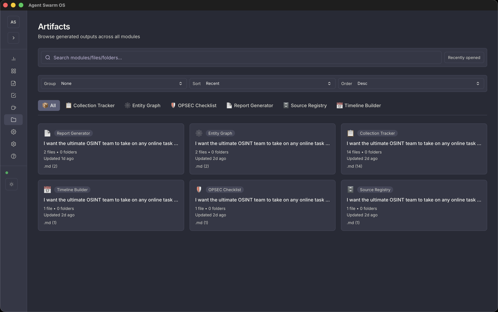
  <em>Artifacts - Browse generated outputs across all modules</em>
</p>

<p align="center">
  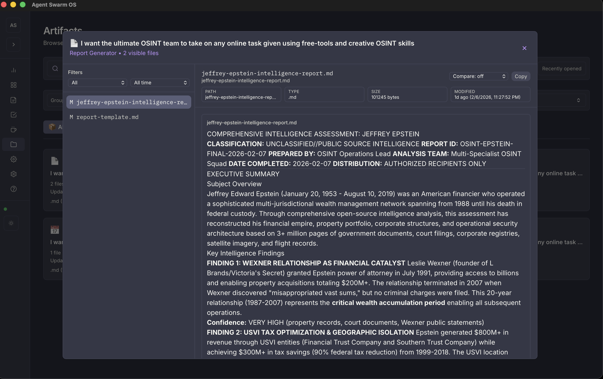
  <em>File Viewer - Read artifact contents with syntax highlighting</em>
</p>

<p align="center">
  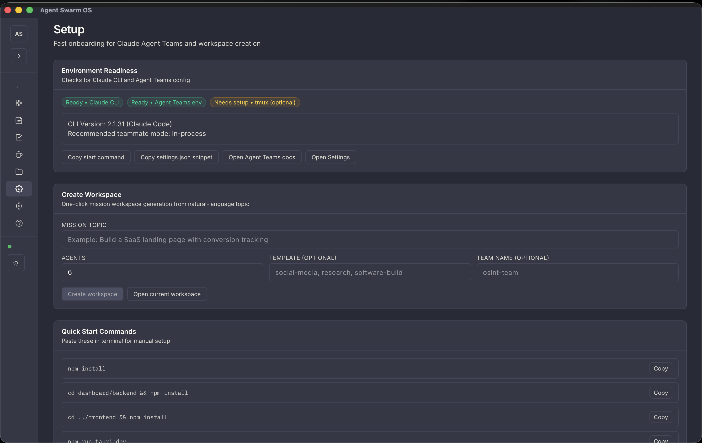
  <em>Setup - Environment readiness checks and one-click workspace creation</em>
</p>

<p align="center">
  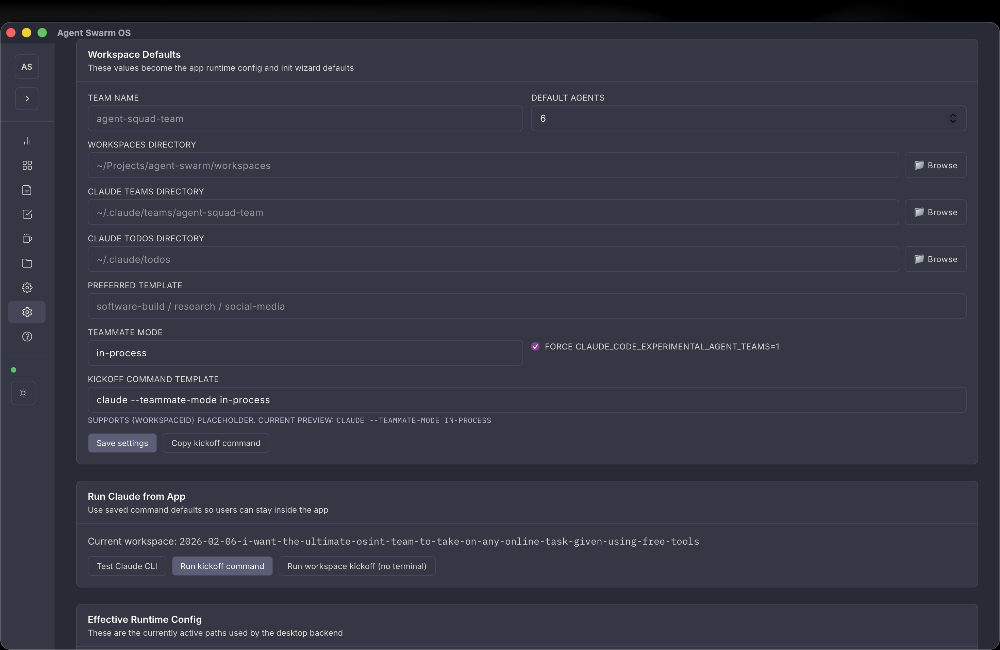
  <em>Settings - Configure workspace defaults, paths, and Claude Agent Teams integration</em>
</p>

<p align="center">
  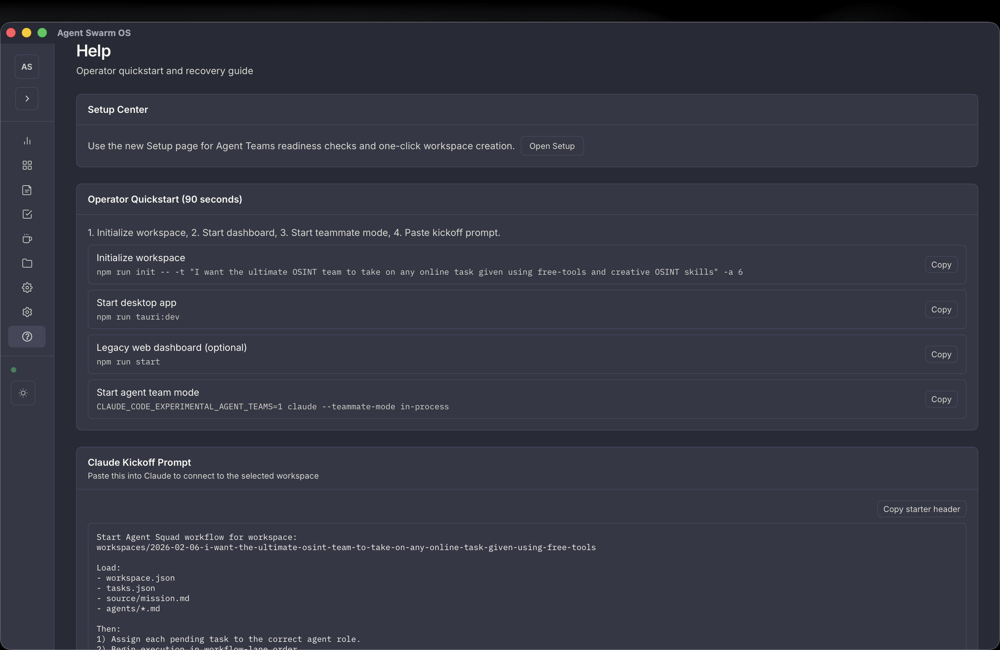
  <em>Help - Operator quickstart with 90-second workflow guide</em>
</p>

<p align="center">
  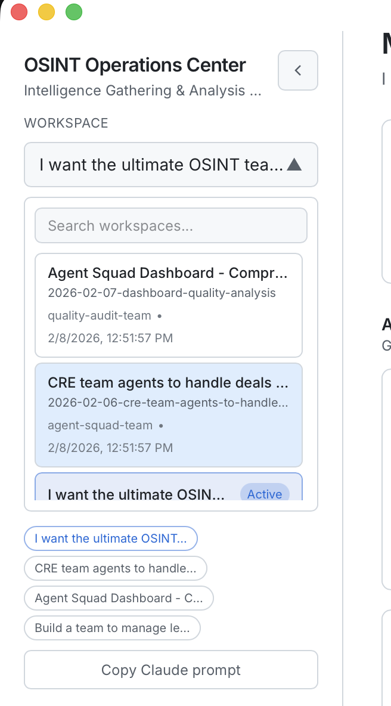
  <em>Workspace Switcher - Navigate between active missions with search and filters</em>
</p>

</details>

## Claude Agent Teams (Required)

This project expects Claude Agent Teams to be enabled for all runs.

Use:
CLAUDE_CODE_EXPERIMENTAL_AGENT_TEAMS=1 claude --teammate-mode in-process

Reference: https://code.claude.com/docs/en/agent-teams.md

## Quick Start (Desktop / Tauri)

### Prerequisites

- Node.js 18+
- Rust toolchain (`rustc` + `cargo`)
- Claude CLI installed and authenticated (`claude --help` works)

#### Installing Prerequisites

**Node.js 18+**

Check if already installed:
```bash
node --version  # Should be v18.0.0 or higher
npm --version
```

If not installed:
- **macOS**: `brew install node` or download from [nodejs.org](https://nodejs.org/)
- **Linux**: `curl -fsSL https://deb.nodesource.com/setup_20.x | sudo -E bash - && sudo apt-get install -y nodejs`
- **Windows**: Download installer from [nodejs.org](https://nodejs.org/)

**Rust Toolchain (rustc + cargo)**

Check if already installed:
```bash
rustc --version
cargo --version
```

If not installed:
```bash
# All platforms (recommended)
curl --proto '=https' --tlsv1.2 -sSf https://sh.rustup.rs | sh

# Follow prompts, then reload your shell:
source $HOME/.cargo/env
```

Alternative installation methods:
- **macOS**: `brew install rust`
- **Windows**: Download from [rustup.rs](https://rustup.rs/)

**Claude CLI**

Check if already installed:
```bash
claude --version
```

If not installed:
```bash
# macOS/Linux
curl -fsSL https://cli.anthropic.com/install.sh | sh

# Or with npm (all platforms)
npm install -g @anthropic-ai/claude-cli

# Verify installation
claude --version

# Authenticate (required on first use)
claude auth login
```

### 1) Install dependencies

```bash
npm install
cd dashboard/backend && npm install
cd ../frontend && npm install
```

### 2) Launch desktop app

```bash
npm run tauri:dev
```

### 3) Setup Agent Teams (first run)

From inside the app:

1. Open `Setup` page.
2. Confirm Claude CLI and Agent Teams readiness.
3. Open `Settings` to set team/path defaults and Claude kickoff command once.
4. Create a workspace from natural language.
5. Run Claude kickoff directly from `Settings` (no terminal required).

Or use terminal:

```bash
CLAUDE_CODE_EXPERIMENTAL_AGENT_TEAMS=1 claude --teammate-mode in-process
```

### 4) Start a mission workspace manually (optional)

```bash
npm run init -- -t "legal team agents to handle contracts" -a 6
```

Optional flags:

- `--template <social-media|research|software-build>` fallback hint
- `--team-name <name>`
- `--wizard`

### First Launch (Desktop App)

When you first launch the Tauri desktop app, you'll be prompted to select your workspace directory:

1. Click "📁 Browse for Workspace Directory"
2. Navigate to where you keep (or want to keep) your Agent Squad workspaces
3. Select the folder and click "Continue"

**Don't have workspaces yet?** Just select an empty folder - you can create your first workspace using the Setup wizard after configuration.

**Settings are stored in:** `.agentsquad.desktop-settings.json` in the project root (or wherever the app detects as project root)

**To reconfigure:** Delete the settings file or manually edit it, then restart the app.

## Dashboard Development

### Quick Start

The dashboard requires both backend and frontend servers running simultaneously.

**Option 1: Use npm script (recommended)**
```bash
cd dashboard
npm install  # First time only - installs concurrently
npm run dev
```

This starts both servers with color-coded output:
- **Backend**: http://localhost:3001 (Express API)
- **Frontend**: http://localhost:5173 (Vite dev server)

**Option 2: Use Makefile**
```bash
cd dashboard
make install  # First time only
make dev
```

**Option 3: Manual startup (if above fails)**
```bash
# Terminal 1 - Backend
cd dashboard/backend
node server.js

# Terminal 2 - Frontend
cd dashboard/frontend
npm run dev
```

### Port Requirements

- **Backend**: Port 3001 (Express API server)
- **Frontend**: Port 5173 (Vite dev server with HMR)
- Frontend proxies `/api/*` requests to backend automatically

### Troubleshooting

**Error: "Failed to load resource: 500 Internal Server Error"**
- Make sure backend is running on port 3001
- Check backend logs: `tail -f dashboard/backend/logs/*.log`
- Verify workspaces directory exists with valid workspace.json files

**Port already in use:**
```bash
cd dashboard
make stop  # or: lsof -ti:3001,5173 | xargs kill -9
```

**Dependencies not installed:**
```bash
cd dashboard
make install  # or: npm run install:all
```

### Available Commands

From `dashboard/` directory:

| Command | Description |
|---------|-------------|
| `npm run dev` | Start both backend + frontend |
| `npm run dev:backend` | Start only backend (port 3001) |
| `npm run dev:frontend` | Start only frontend (port 5173) |
| `npm run build` | Build production frontend |
| `npm run install:all` | Install all dependencies |
| `make dev` | Start both servers (alternative) |
| `make stop` | Stop all running servers |
| `make install` | Install all dependencies (alternative) |

### Production Build

```bash
cd dashboard
npm run build  # Outputs to frontend/dist/
```

Then serve with your preferred static file server or integrate with Tauri desktop app.

## How Init Works

`npm run init` does the following:

1. Collects mission input (`topic`, `agent count`, optional `template hint`, `team name`).
2. Calls Claude CLI in JSON mode with schema constraints.
3. Validates/normalizes blueprint (`<= 8` agents, unique IDs, coordinator presence).
4. Falls back to nearest built-in template if synthesis fails.
5. Scaffolds workspace under `workspaces/{date}-{slug}/`.
6. Writes audit artifacts under `.agentsquad/`.

## Prompt Source Of Truth

- Built-in template role prompts are loaded from:
  - `templates/agent-squad/{template-id}/prompts/{role-id}.md`
- During init, prompt markdown is preferred over `template.json` inline prompt text.
- If a role prompt markdown file is missing, init falls back to that role's `template.json` prompt.
- This allows role prompt depth and behavior updates without changing template schema.

## Workspace Structure

```text
workspaces/{YYYY-MM-DD}-{slug}/
  workspace.json
  tasks.json
  source/mission.md
  agents/*.md
  artifacts/{module-id}/
  .agentsquad/
    blueprint.request.json
    blueprint.response.json
    blueprint.validated.json
    synthesis.meta.json
```

## Dashboard API

- `GET /api/workspace` active manifest + synthesis metadata
- `GET /api/agents` manifest agents with inferred runtime status
- `GET /api/tasks` task list + summary + workflow lanes
- `GET /api/comms` team feed messages (`?since=` supported)
- `GET /api/artifacts` workspace/module file summaries
- `GET /api/artifacts/:workspaceId` module file listing for workspace
- `GET /api/artifacts/:workspaceId/:moduleId` file contents for module
- `GET /api/health` health + workspace/synthesis status

### Workspace Isolation Behavior

- Workspace queries are strict:
  - If `workspaceId` is provided and not found, the API returns an empty, workspace-safe payload.
  - The API does not fall back to the latest workspace when an explicit `workspaceId` is invalid.
- Missing workspace responses include:
  - `requestedWorkspaceId`
  - `workspaceNotFound` (boolean)
- Tasks and comms are workspace-scoped only:
  - `tasks.json` in the selected workspace is always included.
  - `~/.claude/todos` items must include matching workspace tagging to appear.
  - Comms feed lines must include matching workspace tagging to appear.

### Required Workspace Tagging

- Todo/task payloads should include one of:
  - `workspaceId`
  - `workspace_id`
  - `workspace`
- Comms feed lines should include one of:
  - `workspaceId`
  - `workspace_id`
  - `workspace`
- Unscoped/global entries are ignored in workspace-scoped dashboard views.

Legacy aliases are still available for compatibility:

- `/api/coffee-room` -> `/api/comms`
- `/api/content` -> `/api/artifacts`

## Scripts

### Root Directory

- `npm run init` - Initialize workspace with AI synthesis
- `npm run reset` - Archive active workspaces and team feed
- `npm run tauri:dev` - Run the desktop app in development
- `npm run tauri:build` - Build desktop binaries

### Dashboard Directory (`cd dashboard`)

- `npm run dev` - Start both backend + frontend (port 3001 + 5173)
- `npm run dev:backend` - Start only backend server (port 3001)
- `npm run dev:frontend` - Start only frontend server (port 5173)
- `npm run build` - Build production frontend
- `npm run install:all` - Install all dependencies (root, backend, frontend)
- `make dev` - Alternative to npm run dev (requires make)
- `make stop` - Stop all running servers
- `make install` - Alternative to npm run install:all

## Reset Behavior

`npm run reset` moves workspace folders to `workspaces/archive/` and archives `team-feed.jsonl`.

## Built-in Fallback Templates

- `social-media`
- `research`
- `software-build`

These are used when AI synthesis fails or as template hints during initialization.
